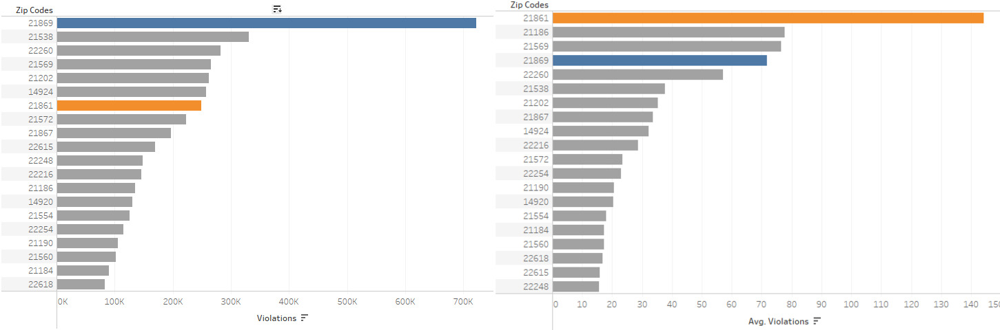

# Individual project

## Zip codes and their violations:
The general observation of zipcode and their corresponding number of violations can tell us a lot about which areas have high number of violations.

.png)

But to find the areas which are at risk due to the speed violations we should determine those areas with high average of violations, because data for some of these zip codes is recent and has less count of data.

.png)

If we compare the two graphs we can see that zipcode 21869 has highest number of traffic violations but it drops to the fourth position when we consider the average number of speed violations whereas zipcode 21861 is seventh in the total number of violations but has the highest average violations overall. 

## Violations and relation with the Quarters:
If we observe the line graphs for the zip codes with top five average violations per day we can observe that the average violations increase in Q2 and Q3 and drop in Q4 and Q1.

.png)

If we plot a line graph for all the quarters we can observe two points, overall there has been a decline in the average number of violations and also that the trend observed from the top five zipcodes can be seen even for the dataset as a whole, where the average violations increase in Q2 and Q3 and drop in Q4 and Q1.

.png)

A better way to plot the graph would be

.png) 

We can see that the average violations for Q3 has been the highest for all the years and thus it is high for all the data.

## Weekday wise Average Violations change over the years:

If we see the distribution of average violations for different week days we can see that the violations have been high for Saturday and Sunday.

.png) 

It will be interesting to see the trend for the weekday average violaions over the years.

.png) 

As we can see the average violations for each of the weekday has been consistently decreasing, which proves the program for controlling speed violations has been successfull.

## Relation between M/F ratio to violations chart:

First I plotted the general trend of the number of violations over the map of Chicago where we can observe that some of the areas have higher data violations as compared to other areas.

.png) 

It would really be interesting to find some relation of these violations with the male to female ratio of the city, to see if they are related in some way.

.png) 

In this visualization we can see the colour of areas in the map represent the ratio of male population to female population in that area and the area and colour of the bubble represents the average number of violations in that area, leaving a few areas, we can see a general relation where the M/F ratio is high the average number of violations are high. 

Tableau Public Link:
https://public.tableau.com/profile/ajay.ratnadeep.deshmukh#!/vizhome/ChicagoSpeedViolations_15565208082240/Sheet1

References:
1.https://data.cityofchicago.org/Transportation/Speed-Camera-Violations/gncf-3xbx
